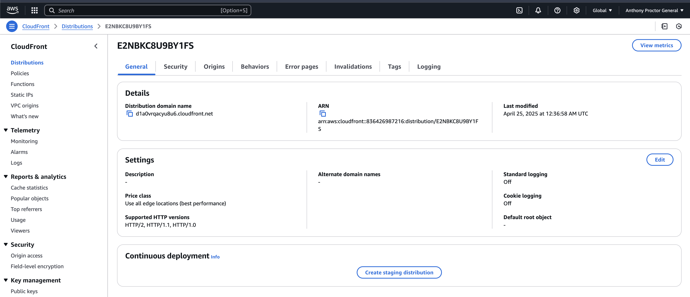
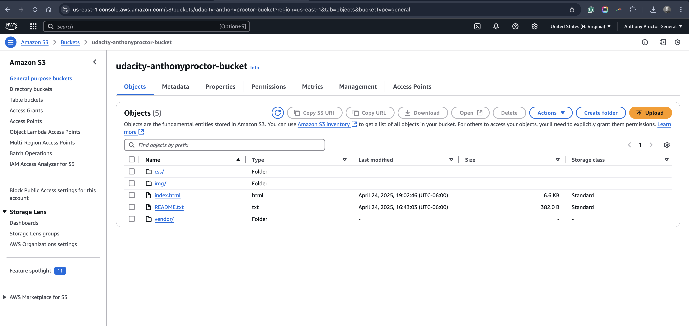

# Deploy Static Website on AWS

This project demonstrates how to deploy a static website using AWS S3 and CloudFront.

## Project Overview

- Host: **Amazon S3**
- CDN: **Amazon CloudFront**
- Site URL:  
  - [S3 Website URL](http://udacity-anthonyproctor-bucket.s3-website-us-east-1.amazonaws.com/)  
  - [CloudFront URL](https://d1a0vrqacyu8u6.cloudfront.net/index.html)

## Steps Completed

1. Created and configured an S3 bucket for static website hosting.
2. Uploaded HTML, CSS, JS, and asset files.
3. Configured public access via IAM policy.
4. Set up a CloudFront distribution for faster content delivery.
5. Verified website deployment through both endpoints.

## Screenshots

| Description                        | Screenshot |
|------------------------------------|------------|
| Website Live via S3                |  |
| CloudFront Distribution Settings   |  |
| S3 Bucket Files                    |  |

## Reminder

Once the project has been reviewed and approved, delete or disable the AWS resources to prevent unnecessary charges.

---

*Project submitted for Udacity Cloud Foundations Nanodegree*
